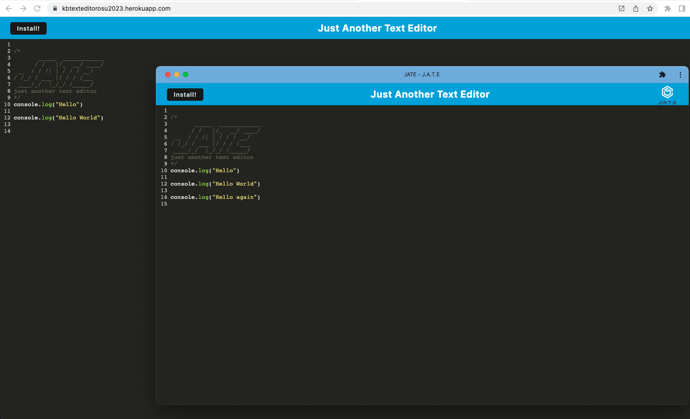

# Progressive Web Applications (PWA): Text Editor
User will navigate Text Editor application to make notes and code snippets. User has the option to download application to use offline to retrieve them for a later time.

## Description 
This application follows a client/server progressive web application (PWA) framework. Users can start server from code using `npm run start` or by navigating to deployed Heroku application. When app is running on the deployed app, user may add text to the editor. User can click install on the app to download for use without internet connection. 

[GitHub Repo](https://github.com/kristinbrewer/text-editor-pwa)

[Heroku App](https://kbtexteditorosu2023.herokuapp.com/)

[Video Walk Through](https://drive.google.com/file/d/1rCUeq5LaiL-oGPZwFnDz_tjbxv8jrFrF/view)

## Table of Contents
- [Description](#description)
- [Installation](#installation)
- [Usage](#usage)
- [License](#license)
- [Contributing](#contributing)
- [Questions](#questions)

## Installation
`npm i` for initiation in Node.js (v16), click [link](https://kbtexteditorosu2023.herokuapp.com/) to use in Heroku 

## Usage
For local use: after installing dependencies, open terminal in root, `npm run build` followed by `npm run start` to use at local host. For deployed application: navigate to [link](https://kbtexteditorosu2023.herokuapp.com/) and click install in upper left corner to install for offline use

## License
MIT Copyright (c) 2023 kristinbrewer
Permission is hearby granted, free of charge, to any person obtaining a copy of this software and associated documentation files (the "Software"), to deal in the Software without restriction, including without limitation the rights to use, copy, modify, merge, publish, distribute, sublicense, and/or sell copies of the Software, and to permit persons to whom the Software is furnished to do so, subject to the following conditions: The above copyright notice and this permission notice shall be included in all copies or substantial portions of the Software. THE SOFTWARE IS PROVIDED ”AS IS”, WITHOUT WARRANTY OF ANY KIND, EXPRESS OR IMPLIED, INCLUDING BUT NOT LIMITED TO THE WARRANTIES OF MERCHANTABILITY, FITNESS FOR A PARTICULAR PURPOSE AND NONINFRINGEMENT. IN NO EVENT SHALL THE AUTHORS OR COPYRIGHT HOLDERS BE LIABLE FOR ANY CLAIM, DAMAGES OR OTHER LIABILITY, WHETHER IN AN ACTION OF CONTRACT, TORT OR OTHERWISE, ARISING FROM, OUT OF OR IN CONNECTION WITH THE SOFTWARE OR THE USE OR OTHER DEALINGS IN THE SOFTWARE. 

## Contributing
Kristin Brewer

## Questions
For more information, check out my [GitHub](https://github.com/kristinbrewer).
Please email me at: brewer.kristin17@gmail.com with any additional questions. 